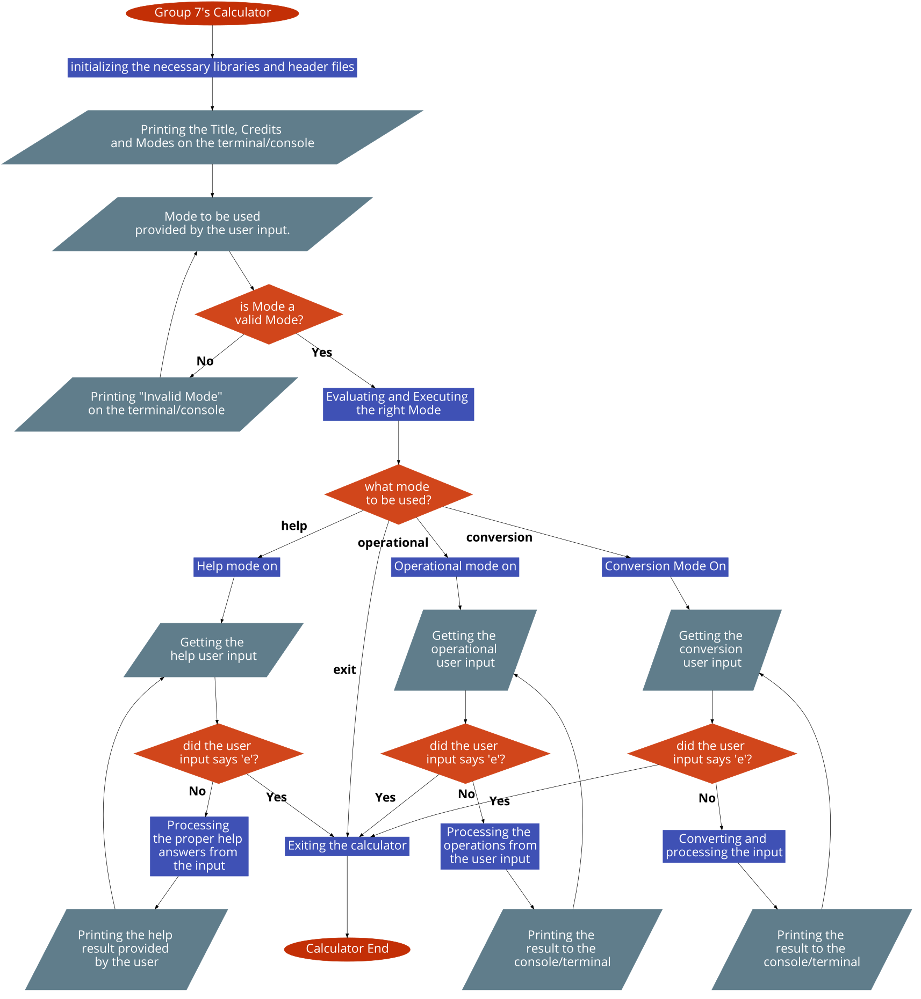

# Group 7's Calculator - Operational & Conversion

---

## Flowchart


---

## Operational Mode
  - Operational Mode contains 4 operators and runs in a single operation.

### Code
```C
void operational()
{
    char stat;
    int argc;
    char operator_;
    double result, first_num, second_num;

    printf("\n[MODE]: Operational Mode On\n\n");
    
    while (OPT_RUNNING)
        {
            printf(">> ");
            argc = scanf(" %lf %c %lf", &first_num, &operator_, &second_num);
            if (argc <= 0)
            {
                scanf(" %c", &stat);
                if (stat == 'e'){puts("\nExiting...\n");break;};
            };

            switch (operator_)
                {
                    case '*':
                        result = first_num * second_num;
                        printf("%.3lf %c %.3lf = %.3lf\n", first_num, operator_, second_num, result);
                        break;
                    case '/':
                        result = first_num / second_num;
                        printf("%.3lf %c %.3lf = %.3lf\n", first_num, operator_, second_num, result);
                        break;
                    case '+':
                        result = first_num + second_num;
                        printf("%.3lf %c %.3lf = %.3lf\n", first_num, operator_, second_num, result);
                        break;
                    case '-':
                        result = first_num - second_num;
                        printf("%.3lf %c %.3lf = %.3lf\n", first_num, operator_, second_num, result);
                        break;
                    default:
                        printf("Invalid operator (%c).\n", operator_);
                        break;
                }; 
        }
}
```

### Output

```
Mode: operational

[MODE]: Operational Mode On

>> 14 + 7
14.000 + 7.000 = 21.000
>> 14 - 7
14.000 - 7.000 = 7.000
>> 14 * 7
14.000 * 7.000 = 98.000
>> 14 / 7
14.000 / 7.000 = 2.000
```

---

## Conversion Mode
  - Conversion mode converts all possible units within the measuring type based on the specified unit.

### Whole Code
```C
void converts(Unit unit)
{
    if (!strcmp(unit.mname, measure_names[0]))
    {
        length_conversion(unit);
    }
    else if (!strcmp(unit.mname, measure_names[1]))
    {
        time_conversion(unit);
    }
    else if (!strcmp(unit.mname, measure_names[2]))
    {
        temperature_conversion(unit);
    }
    else if (!strcmp(unit.mname, measure_names[3]))
    {
        mass_conversion(unit);
    }
};

void conversion()
{
    char unit[CONV_MAX];
    char exit_stat;
    double number;
    int inumber;

    printf("\n[MODE]: Conversion Mode On\n\n");
    
    while (CONV_RUNNING)
        {
            printf("\n>> ");
            int argc = scanf(" %lf %s", &number, unit);

            if (argc <= 0)
            {
                scanf(" %c", &exit_stat);
                if (exit_stat == 'e'){puts("\nExiting...\n");break;};
            };

            if (!is_unit(unit))
                {
                    printf("Invalid unit (%s).\n", unit);
                    continue;
                }
            
            Unit unit_ = get_unit_info(unit, number);
            converts(unit_);
        }
}
```

### Length Conversion Code
```C
char conv_units[][CONV_MAX][CONV_MAX] = {
    {
    "mm", "cm", "m", "km", "in", "ft", "yd", "mi"
    },
    {
    "ms", "s", "min", "hr", "day", "wk", "mon", "yr"
    },
    { "K", "F", "C", "||", "||", "||", "||", "||"
    },
    {
    "mg", "g", "kg", "oz", "lb", "lt", "||", "||"
    }
};

void length_conversion(Unit unit)
{
    if (!strcmp(unit.unit_, conv_units[unit.measure_id][0]))
    {...}
    else if (!strcmp(unit.unit_, conv_units[unit.measure_id][1]))
    {...}
    else if (!strcmp(unit.unit_, conv_units[unit.measure_id][2]))
    {...}
    else if (!strcmp(unit.unit_, conv_units[unit.measure_id][3]))
    {...}
    else if (!strcmp(unit.unit_, conv_units[unit.measure_id][4]))
    {...}
    else if (!strcmp(unit.unit_, conv_units[unit.measure_id][5]))
    {...}
    else if (!strcmp(unit.unit_, conv_units[unit.measure_id][6]))
    {...}
    else if (!strcmp(unit.unit_, conv_units[unit.measure_id][7]))
    {...}
};
```

### Output
```
Mode: conversion

[MODE]: Conversion Mode On


>> 14 in

Measuring Type: Length (in) Value: 14.000

    To Millimeter: 355 mm   (355.600 mm)
    To Centimeter: 35 cm    (35.560 cm)
    To Meter: 0 m   (0.356 m)
    To Kilometer: 0 km  (0.00036 km)
    To Foot: 1 ft   (1.167 ft)
    To Yard: 0 yd   (0.389 yd)
    To Mile: 0 mi   (0.00022 mi)
```

### Time Conversion Code

```C
char conv_units[][CONV_MAX][CONV_MAX] = {
    {
    "mm", "cm", "m", "km", "in", "ft", "yd", "mi"
    },
    {
    "ms", "s", "min", "hr", "day", "wk", "mon", "yr"
    },
    { "K", "F", "C", "||", "||", "||", "||", "||"
    },
    {
    "mg", "g", "kg", "oz", "lb", "lt", "||", "||"
    }
};

void time_conversion(Unit unit)
{
    if (!strcmp(unit.unit_, conv_units[unit.measure_id][0]))
    {...}
    else if (!strcmp(unit.unit_, conv_units[unit.measure_id][1]))
    {...}
    else if (!strcmp(unit.unit_, conv_units[unit.measure_id][2]))
    {...}
    else if (!strcmp(unit.unit_, conv_units[unit.measure_id][3]))
    {...}
    else if (!strcmp(unit.unit_, conv_units[unit.measure_id][4]))
    {...}
    else if (!strcmp(unit.unit_, conv_units[unit.measure_id][5]))
    {...}
    else if (!strcmp(unit.unit_, conv_units[unit.measure_id][6]))
    {...}
    else if (!strcmp(unit.unit_, conv_units[unit.measure_id][7]))
    {...}
};
```

### Output
```
>> 14 day

Measuring Type: Time (day)  Value: 14.000

    To Milliseond: 1209600000 ms    (1.210E+09 ms)
    To Second: 1209600 s    (1.210E+06 s)
    To Minute: 20160 min    (2.016E+04 min)
    To Hour: 336 hr (3.360E+02 hr)
    To Week: 2 wk   (2.000E+00 wk)
    To Month: 0 mon (4.603E-01 mon)
    To Year: 0 yr   (3.836E-02 yr)
```

### Temperature Conversion Code
```C
char conv_units[][CONV_MAX][CONV_MAX] = {
    {
    "mm", "cm", "m", "km", "in", "ft", "yd", "mi"
    },
    {
    "ms", "s", "min", "hr", "day", "wk", "mon", "yr"
    },
    { "K", "F", "C", "||", "||", "||", "||", "||"
    },
    {
    "mg", "g", "kg", "oz", "lb", "lt", "||", "||"
    }
};

void temperature_conversion(Unit unit)
{
    if (!strcmp(unit.unit_, conv_units[unit.measure_id][0]))
    {...}
    else if (!strcmp(unit.unit_, conv_units[unit.measure_id][1]))
    {...}
    else if (!strcmp(unit.unit_, conv_units[unit.measure_id][2]))
    {...}
};
```

### Output
```
>> 14 F

Measuring Type: Temperature (F) Value: 14.000

    To Kelvin: 263 K    (263.1500 K)
    To Celcius: -10 C   (-10.0000 C)
```

### Mass/Weight Conversion Code
```C
char conv_units[][CONV_MAX][CONV_MAX] = {
    {
    "mm", "cm", "m", "km", "in", "ft", "yd", "mi"
    },
    {
    "ms", "s", "min", "hr", "day", "wk", "mon", "yr"
    },
    { "K", "F", "C", "||", "||", "||", "||", "||"
    },
    {
    "mg", "g", "kg", "oz", "lb", "lt", "||", "||"
    }
};

void time_conversion(Unit unit)
{
    if (!strcmp(unit.unit_, conv_units[unit.measure_id][0]))
    {...}
    else if (!strcmp(unit.unit_, conv_units[unit.measure_id][1]))
    {...}
    else if (!strcmp(unit.unit_, conv_units[unit.measure_id][2]))
    {...}
    else if (!strcmp(unit.unit_, conv_units[unit.measure_id][3]))
    {...}
    else if (!strcmp(unit.unit_, conv_units[unit.measure_id][4]))
    {...}
    else if (!strcmp(unit.unit_, conv_units[unit.measure_id][5]))
    {...}
};
```

### Output
```
>> 14 lb

Measuring Type: Mass/Weight (lb)    Value: 14.000

    To Milligram: 6350288 mg    (6.3503E+06 mg)
    To Gram: 6356 g (6.3560E+03 g)
    To Kilogram: 6 kg   (6.3492E+00 kg)
    To Ounce: 224 oz    (2.2400E+02 oz)
    To Ton 0 lt (7.0000E-03 lt)
```

---

## Help Mode
  - Help Mode outputs the help messages based on the user's input.

### Code
```C
void helps_ ()
{
    char h_[MAX];
    int argc;

    printf("\n[MODE]: Help Mode On\n\n");
    
    while (RUNNING)    
    {
        printf(">> ");
        argc = scanf(" %s", h_);
        
        if (!strcmp(h_, helps[0]))
        {
            puts(operational_);
        }
        else if (!strcmp(h_, helps[1]))
        {
            puts(conversion_);
        }
        else if (!strcmp(h_, "e") || !strcmp(h_, "exit"))
        {
            break;
        }
        else
        {
          printf("Invalid help command (%s)\n", h_);
        };
    }
}
```

---

## Mode Control
  - Mode Control will control and run which mode the user wants and will output an error message if mode is invalid.

### Code
```C
int in_modes(char *mode)
{
    for (int i=0; i<4; i++)
        {
            if (!strcmp(mode, all_modes[i]))
            {
                return 1;
            }
            else
            {
                continue;
            }
        }

    return 0;
}

void eval_mode(int mode)
{
    switch (mode)
        {
            case 0:
                helps_();
                break;
            case 1:
                operational(); break;
            case 2:
                conversion(); break;
        }
}

int get_mode(char *mode)
{
    for (int i=0; i < 4; i++)
        {
            if (!strcmp(mode, all_modes[i])){return i;}
        }
    return 6;
}
```

---

## Thanks for Watching :>
